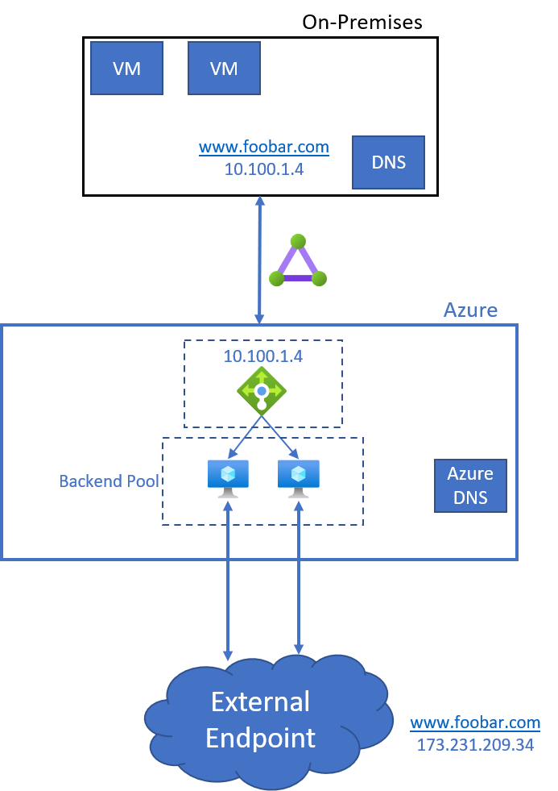

# Securely connect to an External Endpoint from Azure

## Introduction
This is a simple solution that uses an Azure Standard Load Balancer and 2 VMs to forward packets to a destination endpoint as shown in the figure below:


## Installation
1. Run ```./create_infra.sh``` which will create all the necessary infrastructure
2. Login to each of the forwarding VMs (this assumes you're connecting via Bastion VM):
   ```
   ssh bastionvm
   ssh fwdvm1
   sudo apt-get update && sudo apt install iptables-persistent netfilter-persistent -y
   sudo curl -o /usr/local/bin/ip_fwd.sh https://raw.githubusercontent.com/sajitsasi/ip-forward-azure/main/ip_fwd.sh
   sudo chmod +x /usr/local/bin/ip_fwd.sh
   echo "net.ipv4.ip_forward=1" | sudo tee -a /etc/sysctl.conf
   sudo sysctl -p
   sudo /usr/local/bin/ip_fwd.sh -i eth0 -f 80 -a <dest_hostname> -p 80
   sudo /usr/local/bin/ip_fwd.sh -i eth0 -f 443 -a <dest_hostname> -p 443
   ```


## Contributing

This project welcomes contributions and suggestions.  Most contributions require you to agree to a
Contributor License Agreement (CLA) declaring that you have the right to, and actually do, grant us
the rights to use your contribution. For details, visit https://cla.microsoft.com.

When you submit a pull request, a CLA-bot will automatically determine whether you need to provide
a CLA and decorate the PR appropriately (e.g., label, comment). Simply follow the instructions
provided by the bot. You will only need to do this once across all repos using our CLA.

This project has adopted the [Microsoft Open Source Code of Conduct](https://opensource.microsoft.com/codeofconduct/).
For more information see the [Code of Conduct FAQ](https://opensource.microsoft.com/codeofconduct/faq/) or
contact [opencode@microsoft.com](mailto:opencode@microsoft.com) with any additional questions or comments.
